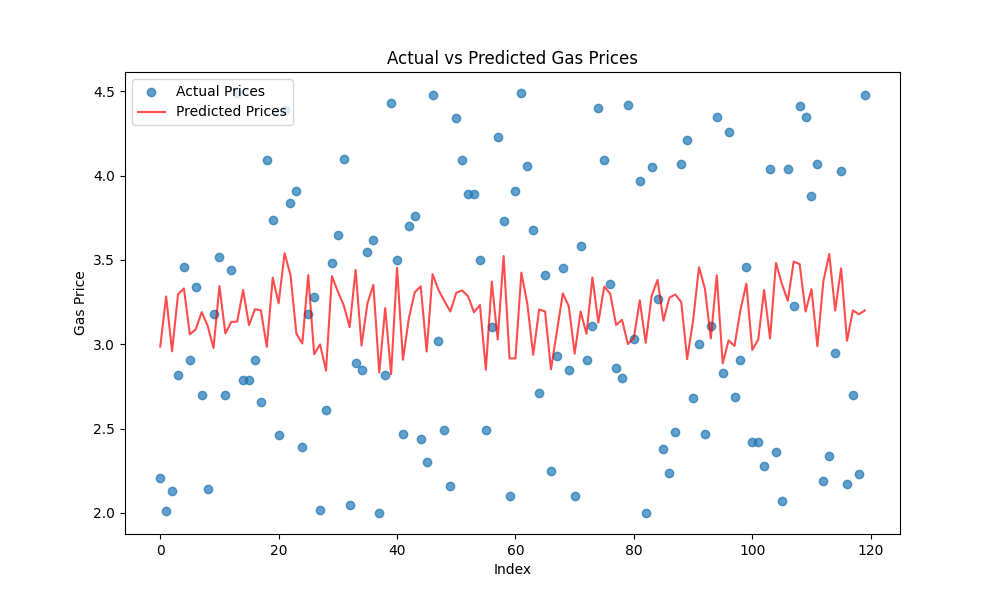
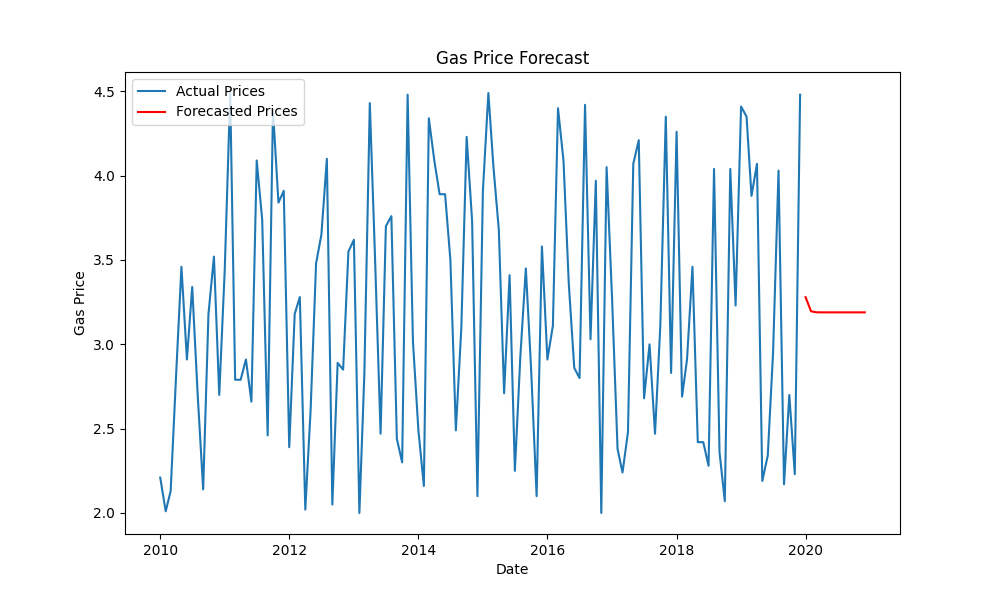

# Project Title: Gas Price Prediction Project.
    Objective: Describe the goals (e.g., predicting gas prices using regression and time series forecasting).


# Dataset:
    (created a mock data set using some actual public data from https://www.eia.gov/


# Steps to Run:
    1. Preprocess the dataset:
       ```bash
       python3 scripts/preprocess_data.py

       
    2. Train regression model:
        python3 scripts/regression_model.py

        
    3. Train time series model:
        python3 scripts/time_series_model.py


    4. Run the full pipeline:
        python3 scripts/run_pipeline.py

    
# Results 
    1. Highlight key insights from the results.
    
    2. Include the R-squared value from the regression summary.
    
    3. Mention any trends observed in the forecast plot.
    
    4. Optionally, embed images of visualizations: 
        
        


    
